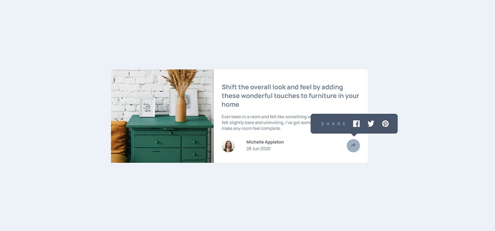

# Frontend Mentor - Article preview component solution

This is a solution to the [Article preview component challenge on Frontend Mentor](https://www.frontendmentor.io/challenges/article-preview-component-dYBN_pYFT).
I focused on practicing css grid and BEM methodology.

## The challenge

Users should be able to:

- View the optimal layout for the component depending on their device's screen size
- See the social media share links when they click the share icon

## Built with

- HTML5
- CSS 
- CSS Grid

### Continued development

To do: correct the social media box in the mobile view; improve responsiveness 
In future projects, I want to focus on creating a responsive layout with grid.

### Screenshot

